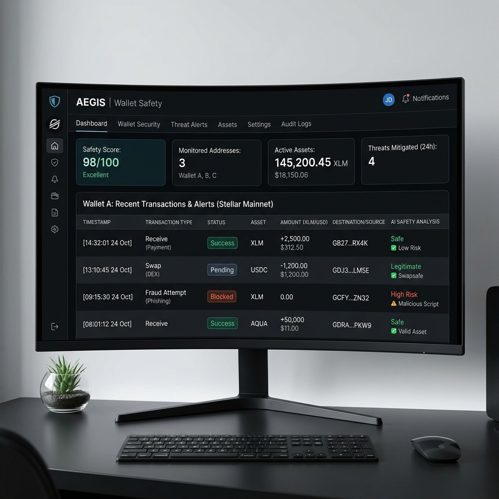
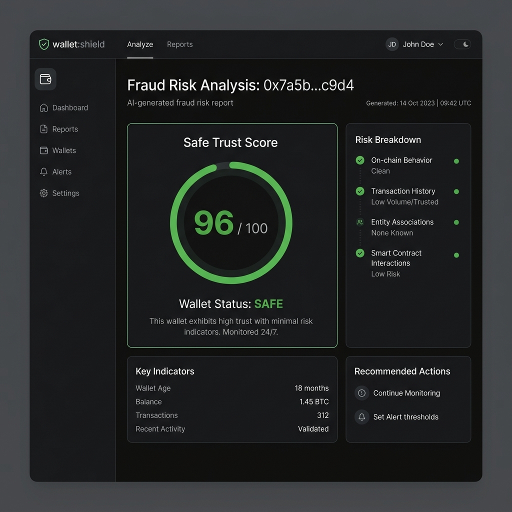

# Clarix — AI-Powered Wallet Safety on the Stellar Blockchain

> **Live Demo:** [clarix-beta.vercel.app](https://clarix-beta.vercel.app)

Clarix is an AI-powered wallet safety mini-dApp built on the **Stellar blockchain**. Before making a payment, simply scan any wallet address to receive an instant AI-generated risk assessment. Every fraud report is **permanently anchored to the Stellar Testnet** via Soroban smart contracts, giving you tamper-proof, verifiable intelligence.

---

## The App

| Dashboard | AI Risk Report |
|---|---|
|  |  |

---

## Features

### Wallet-First Authentication
- **Mandatory Wallet Connection at Signup** — Users must connect a Freighter or Albedo wallet (via Stellar Wallets Kit) during account creation; the public key is validated on the client before registration is permitted.
- **Strict Input Validation** — Email format, password length (≥ 6 chars), password confirmation, name length (≥ 2 chars), and Stellar address format (`G…` 56 chars) are all enforced client-side.
- **Session Persistence** — Login sessions are stored locally so users remain authenticated across page refreshes.

---

### AI Wallet Scanner (Fee-Gated)
- **One-click Risk Analysis** — Paste any Stellar testnet address and pay a flat **0.05 XLM** fee via the connected wallet; the dApp then fetches live Horizon data and runs the full analysis pipeline.
- **Multi-Signal Heuristic Engine** — The `analysisService` evaluates five independent risk signals:
  1. **Wallet Age** — New wallets (< 7 days) receive an automatic danger penalty.
  2. **Burst Transaction Detection** — ≥ 30 operations in a single UTC-hour triggers a high-risk flag consistent with automated draining scripts.
  3. **Outgoing Payment Ratio** — Wallets sending > 85% of all payments are flagged as possible fund-draining addresses.
  4. **Balance vs. Activity** — High-activity wallets with < 1 XLM remaining are flagged.
  5. **Community Fraud Reports (Supabase)** — If the address has been reported by any user, the score is instantly set to 0 and a critical alert is shown.
- **Trust Score (0–100)** — Aggregates all signals into a colour-coded verdict: Safe (≥ 70), Caution (40–69), High Risk (< 40).
- **Sub-Score Breakdown** — Four radar dimensions (Activity, Age, Pattern, Network ratio) are surfaced in the report for transparency.
- **Recent Operations Table** — The last 5 on-chain operations are shown with type, counterparty, amount, asset, and date.

---

### Fraud Report — On-Chain + Community Registry
- **Dual-Path Submission** — Every fraud report is first saved to the **Supabase `reported_frauds` table** (community registry), then optionally anchored on-chain via the **ClarixRegistry Soroban contract** if the user's Freighter wallet is connected.
- **Freighter Signing Flow** — The dApp builds a Soroban transaction, simulates it for preflight footprint, serialises to XDR, prompts Freighter to sign, and submits via direct JSON-RPC to the Soroban testnet RPC endpoint.
- **Transaction Status UI** — A live status chip shows pending → signing → submitted → success/error states with the on-chain transaction hash when confirmed.
- **Typed Error Handling** — Three custom error classes (`UserRejectedError`, `InsufficientFundsError`, `NetworkError`) surface distinct, actionable messages to the user.
- **Address Validation** — Only valid 56-character `G…` Stellar addresses are accepted for reporting.

---

### CLRX Rewards & Verified Contributor Badge
- **Automatic Reward** — Submitting any fraud report (on-chain or community-only) instantly credits **+10 CLRX** to the reporter's profile.
- **Inter-Contract Minting** — When Freighter is connected, `ClarixRegistry.file_report()` cross-invokes `ClarixReward.reward()` in the same atomic transaction, minting 10 CLRX on-chain.
- **Progress Bar** — The Profile screen displays a live progress bar toward the 50 CLRX threshold for the Verified Badge.
- **Verified Contributor Badge** — Spend 50 CLRX to claim a green "Verified" badge that marks your account as a trusted community reporter.
- **Scam Counter** — The profile shows total scams reported and CLRX per report.
- **Persistent Balance** — CLRX balances are stored in `localStorage` keyed by user email and survive page refreshes.

---

### Live Watchlist
- **Add / Remove Addresses** — Users can save any Stellar address to their personal watchlist (stored in Supabase via `watchlistService`).
- **Real-time Background Analysis** — Every time the Watchlist tab is opened, all saved addresses are re-analysed concurrently against live Horizon data, showing live Trust Score, XLM balance, and operation count.
- **One-Click Re-Scan** — Clicking a watchlist entry navigates directly to a full scan of that address.

---

### Side-by-Side Wallet Comparison (Fee-Gated)
- **Dual Analysis** — Enter two Stellar addresses and pay a flat **0.05 XLM** comparison fee; both wallets are analysed in parallel via `Promise.all`.
- **Comparison Table** — Results are displayed in a three-column layout (Wallet A | Metric | Wallet B) with colour-coded winners for Trust Score, Account Age, XLM Balance, and Total Operations.
- **Winner Highlighting** — The better-performing wallet value is bolded and coloured green for instant readability.

---

### Scan History
- **Automatic Logging** — Every completed scan is saved to `localStorage` with address, score, verdict, and timestamp.
- **Search & Filter** — Users can search by wallet address text and filter by verdict class (All / Safe / Caution / Danger) using pill buttons.
- **One-Click Re-Scan** — Selecting any history entry immediately re-runs a fresh scan.
- **Clear All** — Users can wipe their full scan history with a single confirmation.

---

### User Profile
- **Account Overview** — Displays the logged-in email, connected Stellar wallet address (truncated), and total wallets checked.
- **Wallet Connect / Disconnect** — Users can connect or swap their Freighter wallet directly from the profile via the Stellar Wallets Kit auth modal; the live Freighter address is polled on load.
- **CLRX Rewards Panel** — Shows current balance, scam report count, progress toward the Verified Badge, and a claim button once the 50 CLRX threshold is reached.
- **In-App AI Help Center** — A dedicated AI chat panel (powered by Google Gemini) lets users ask questions about scan results, fees, reporting, or any Clarix feature without leaving the profile.
- **Feature Feedback Form** — Users can submit freeform feedback directly from the profile; submissions are stored in Supabase via `feedbackService`.

---

### Global ClarixAI Chatbot
- **Floating Action Button** — A persistent "Chat" bubble on every screen (including the login page) opens a 360 × 480 chat popup without disrupting navigation.
- **Context-Aware Responses** — Powered by Google Gemini via `aiChatService`; understands Clarix-specific topics (wallet safety, reporting, fees, CLRX rewards).
- **Animated Typing Indicator** — Three pulsing dots signal that the AI is generating a response.
- **Smooth Animation** — The popup fades and slides up via CSS keyframes.

---

### Dark / Light Theme Toggle
- **One-Click Toggle** — A Sun/Moon icon in the navbar switches between dark and light mode.
- **CSS Variable System** — The entire UI is built on CSS custom properties (`--text`, `--surface`, `--primary`, etc.) so both themes are applied instantly without a page reload.
- **Persistent Preference** — The selected theme is saved to `localStorage` and restored on next visit.

---

### Stellar Explorer Integration
- **Transaction Links** — On-chain transaction hashes returned from Soroban are surfaced in the fraud report status panel, giving users a direct reference to verify on any Stellar explorer.
- **Live Testnet Network Badge** — The navbar displays a live `TESTNET` indicator so users always know which network they are operating on.

---

## Inter-Contract Data Flow

When a user identifies and submits a malicious wallet with Freighter connected:

1. **Frontend Call** — The dApp invokes `ClarixRegistry.file_report(reporter_address, suspect_wallet, evidence_hash, reward_contract_id)`.
2. **Registry Storage** — `ClarixRegistry` immutably writes the scam data to the Soroban ledger state.
3. **Inter-Contract Call** — Before finishing execution, `ClarixRegistry` issues a cross-contract invocation to `ClarixReward.reward(reporter_address)`.
4. **Token Minting** — `ClarixReward` mints exactly **10 CLRX** directly into the reporter's wallet within the same atomic transaction.
5. **Frontend Confirmation** — The dApp polls `getTransaction` via JSON-RPC until `SUCCESS` is confirmed, then updates the local CLRX balance and shows the transaction hash.

---

## Fee Structure

| Action | Fee |
|---|---|
| Wallet safety scan | 0.05 XLM |
| Side-by-side wallet comparison | 0.05 XLM |
| Fraud report (on-chain anchor) | Network gas only (BASE_FEE) |
| CLRX → Verified Badge | 50 CLRX |

All XLM fees are collected from the user's connected wallet and sent to the Clarix Treasury address. Fees are enforced by building and submitting a real XLM payment transaction before the premium action is allowed to proceed.

---

## Smart Contract Details (Stellar Testnet)

| Contract | ID |
|---|---|
| **ClarixRegistry** | `CBLTKX433VCXF4TRKGNP4V26UAWJZ6YXC2VVXYGQM2NDIBFIQFTQZGTY` |
| **ClarixReward**   | `CDCLUCN5DQWEHQB3FWP7N6D6NT54WBWAXO5EZI6HCVFBZFT3AIAJCEX7` |
| **Admin Keypair**  | `GDUSDXP3RR7FIY6JOAKPFKULKWJIR6QX4F7OXGAR5PAPGJSCNKATUFF7` |

---

## Tech Stack & CI/CD

| Layer | Technology |
|---|---|
| Frontend | React 18, Vite |
| Blockchain | Stellar Testnet, Soroban (Rust) |
| Wallet Integration | Stellar Wallets Kit (Freighter, Albedo) |
| AI | Google Gemini API |
| Database | Supabase (PostgreSQL) |
| Tests | Vitest |
| CI/CD | GitHub Actions |
| Deployment | Vercel |

An automated GitHub Actions pipeline on every push to `main` runs Vitest unit tests in a `jsdom` environment and builds the production bundle to catch any regressions.

---

## User Feedback

As part of the MVP phase, we collected live user feedback to evolve the dApp's usability. [View the exported Feedback Spreadsheet](./Clarix%20Feedback%20Form%20(Responses).xlsx).

| Feedback | Resolution |
|---|---|
| *"Add a reason to report scammers"* | Integrated `ClarixReward` contract awarding **+10 CLRX per report** and introduced the 50 CLRX Verified Badge incentive. |
| *"Hard to ask questions while scanning"* | Built the **Global floating ClarixAI Chatbot** — available on every screen, including login. |
| *"Signup doesn't feel secure"* | Implemented strict client-side validation: email format, password strength, confirmation matching, and mandatory wallet connection. |

---

## Next Phase Improvements

1. **Decentralized AI Oracles** — Off-chain worker nodes continuously monitoring Stellar Horizon and feeding rolling safety scores natively into Soroban.
2. **Web3 Auth Aggregation** — Replacing email/password entirely with Web3 passkeys and native Freighter authentication protocols.
3. **Advanced Tx Simulation** — Real-time mempool simulation integrated into the dashboard, rendering exact state changes a transaction *would* trigger before signing.
4. **Enhanced Leaderboards** — Transitioning client-side leaderboards into a fully decentralised community ranking index reading from indexing nodes.

---

## Documentation

For full API and AI engine documentation, visit the **Documentation** tab inside the app. For the system architecture, see [architecture.md](./architecture.md).

## License
MIT © 2026 Clarix Inc.
