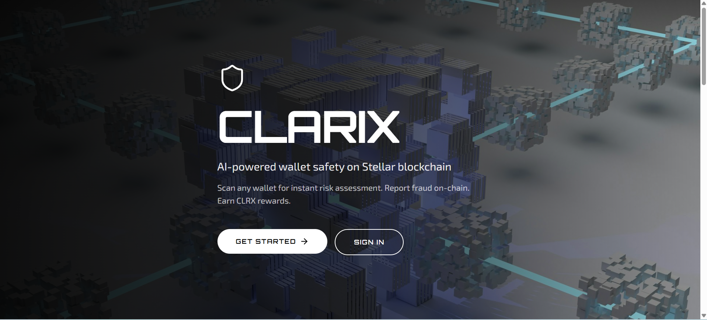
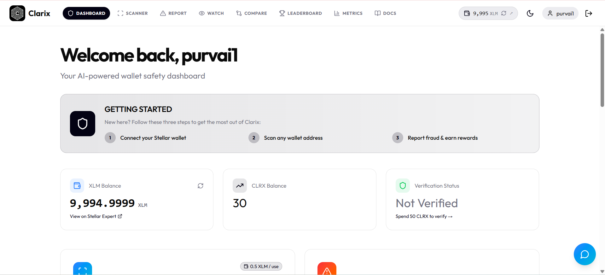
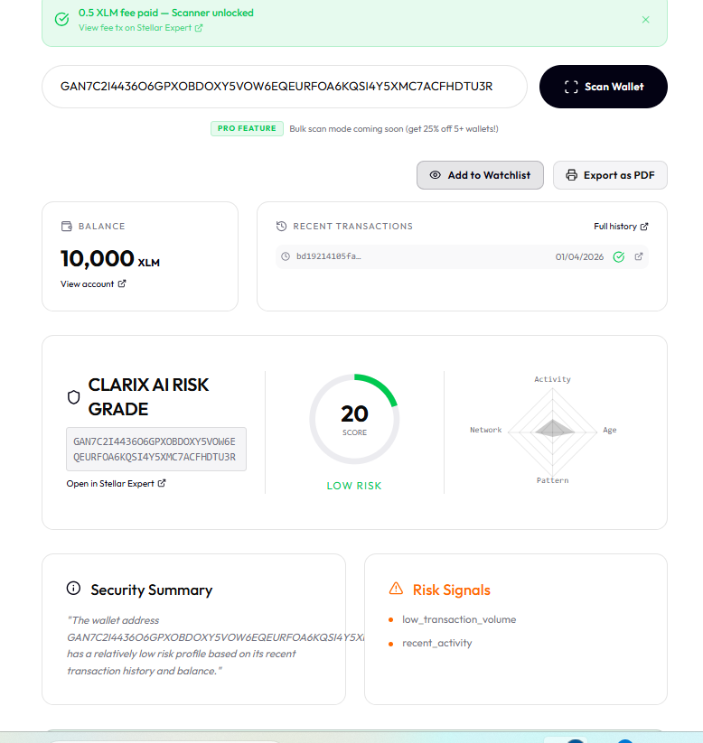
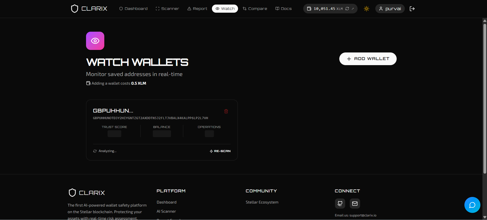
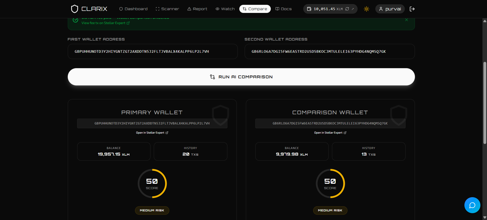
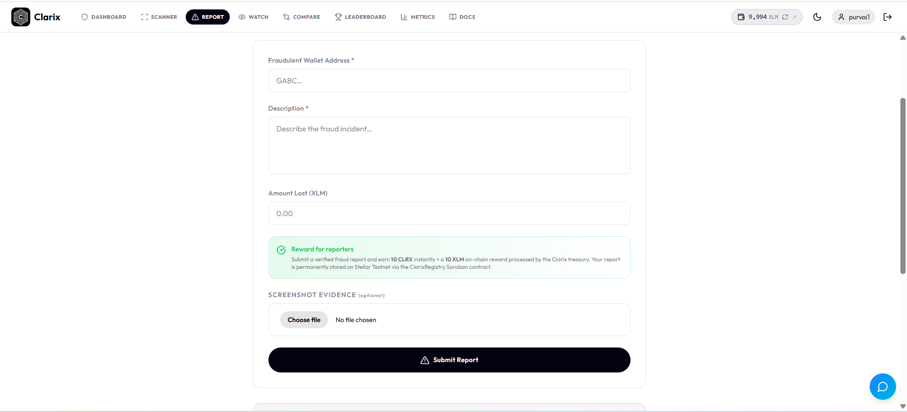
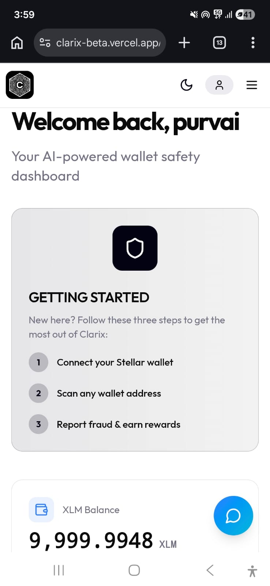
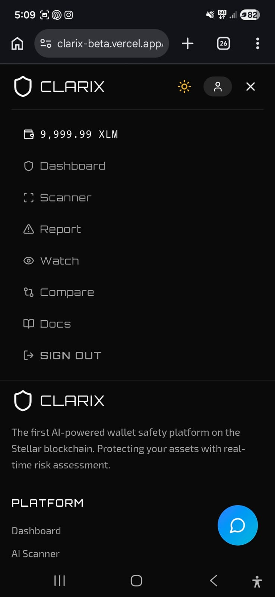

<p align="center">
  
</p>

# Clarix — AI-Powered Wallet Safety on the Stellar Blockchain

[](https://github.com/purvai12/Clarix/actions/workflows/ci.yml)
[](https://clarix-beta.vercel.app/)

> **Demo Video:** [Watch Clarix in Action](https://youtu.be/dQw4w9WgXcQ)

Clarix is an AI-powered wallet safety mini-dApp built on the **Stellar blockchain**. Before making a payment, simply scan any wallet address to receive an instant AI-generated risk assessment. Every fraud report is **permanently anchored to the Stellar Testnet** via Soroban smart contracts, giving you tamper-proof, verifiable intelligence.

---

## The App

| Feature | Preview |
|---|---|
| **Landing Page** |  |
| **Dashboard** |  |
| **AI Risk Report** |  |
| **Live Watchlist** |  |
| **Wallet Comparison** |  |
| **Fraud Reporting** |  |

---

## Core Features
- **AI Wallet Scanner** — Real-time risk scores and detailed radar breakdowns (0.5 XLM fee).
- **On-Chain Fraud Reporting** — Anchor fraud reports permanently to the Stellar Testnet and earn **10 CLRX** rewards.
- **Gasless Transactions** — Fee Sponsorship logic implemented to allow zero-gas fraud reporting (Advanced Feature).
- **Live Monitoring Watchlist** — Save wallets to your personal dashboard with real-time balance and safety tracking.
- **Ecosystem Metrics** — Real-time dashboard tracking platform health, DAU, and reward distribution.
- **Smart Comparisons** — Compare two wallets side-by-side to determine which profile is safer.
- **CLRX Reward System** — Earn tokens for reporting scams and spend them to claim your **Verified Corributor** badge.
- **Integrated AI Helper** — Get instant platform support via the built-in ClarixAI chatbot.

---

## Mobile Experience
Clarix is built with a mobile-first philosophy, ensuring your wallet safety checks are just a tap away on any device.

| Dashboard View | Mobile Navigation |
|---|---|
|  |  |

## Local Setup

### Prerequisites
- **Node.js** (v18+)
- **Freighter Wallet** (for transaction signing)
- **Supabase Account** (for database & auth)

### Installation
1. **Clone the repository:**
   ```bash
   git clone https://github.com/purvai12/Clarix.git
   cd Clarix
   ```
2. **Install dependencies:**
   ```bash
   npm install
   ```
3. **Configure Environment:**
   Create a `.env.local` file in the root and add your keys:
   ```env
   VITE_SUPABASE_URL=your_supabase_url
   VITE_SUPABASE_ANON_KEY=your_anon_key
   VITE_TREASURY_ADDRESS=your_xlm_treasury_address
   VITE_GROQ_API_KEY=your_groq_api_key
   ```
4. **Start Development Server:**
   ```bash
   npm run dev
   ```

---

## Technical Stack
- **Frontend**: React 18, Vite, TailwindCSS
- **Blockchain**: Stellar Testnet, Soroban (Rust)
- **AI**: Groq API (Llama 3)
- **Database**: Supabase (PostgreSQL)

---

## Fee Structure
| Action | Fee |
|---|---|
| Wallet safety scan | 0.5 XLM |
| Side-by-side comparison | 0.5 XLM |
| Watch Wallets | 0.5 XLM |
| Fraud report anchor | Network Gas + 10 CLRX Reward |

---

## User Metrics & Analytics

Clarix integrates **PostHog** for real-time product analytics, tracking:

- **Verified Integrations:** All Core API flows (Stats, Metrics, Indexer, Sponsor) are verified on production.

| Metric | Description |
|---|---|
| **DAU (Daily Active Users)** | Unique wallets active each day via `posthog.identify()` on login |
| **Transactions** | Every on-chain fraud report fires a `fraud_report_submitted` event with wallet address |
| **Retention** | Wallet-based cohort retention — tracks if users return day 1, day 7, day 30 |

### Live DAU & WAU Dashboard (PostHog)
*(See live tracking dashboard inside PostHog project)*
[View Analytics Dashboard](https://us.posthog.com/project/394002/dashboard/1501299)

---

### Table 1: Registered Users (30 Users — Level 6)

| # | User Name | User Email | User Wallet Address |
|---|---|---|---|
| 1 | Yash | [yashann2005@gmail.com](mailto:yashann2005@gmail.com) | `GBWDGDXAN4AW22OBEQADIOSK2GE7EFNDLZDTBJV6AP33SEPTGNNGFDAE` |
| 2 | Akanksha patil | [akankshapatil2099@gmail.com](mailto:akankshapatil2099@gmail.com) | `GBPUHHUNOTD3Y2HIYGNTZGT2AXDDTN5J2FLTJVBALX4KALPP6LP2L7VH` |
| 3 | Avishkar Dinde | [avishkardinde@gmail.com](mailto:avishkardinde@gmail.com) | `GBS7KYBPL4O4IPOFWK524PCXAGXCW3SASKEZKXED7FCMYVISWYGJO5JS` |
| 4 | Avinash Shinde | [avivai1612@gmail.com](mailto:avivai1612@gmail.com) | `GB6RLO6A7DGI5FW6EASTRD2USD5BKOCJMTULELEI63PYHDG4NQMSQ7GK` |
| 5 | Purabhi Patil | [purabhiap11@gmail.com](mailto:purabhiap11@gmail.com) | `GAN7C2I4436O6GPXOBDOXY5VOW6EQEURFOA6KQSI4Y5XMC7ACFHDTU3R` |
| 6 | Bhoomi Oswal | [oswalbhumi3@gmail.com](mailto:oswalbhumi3@gmail.com) | `GAL62YYPPKUGNVUDOLJA476Z2JWREWSKPCP5L3JEXADHO4HQM7WMH3DK` |
| 7 | Tanishka | [tanishka7@gmail.com](mailto:tanishka7@gmail.com) | `GDYVHISILWDAESQ5T3NZVRP3ETTZ2NB2ON6XHKPS5NP7A7ECBG7WZ2VP` |
| 8 | Minakshi | [minu8368@gmail.com](mailto:minu8368@gmail.com) | `GBUFEULELCSEWIBPNPFK65YJ36IMP4OBLZZ3UHKVB6GQCUMQH42YBSOZ` |
| 9 | Swara | [swara25@gmail.com](mailto:swara25@gmail.com) | `GDQOCMTSPH7ROZK5V6ANFY24DGYNSYV5BONU4NRNUVYQN3TLTHLEWJWC` |
| 10 | Dhruv | [dhruv.patnekar@gmail.com](mailto:dhruv.patnekar@gmail.com) | `GAVXFIDQ6MEBFSLEP2DZZEGU5JZX5HXSMQ3N4LDWRRJJN3X6UIKWQIT6` |
| 11 | Rajas | [rajasrtr@gmail.com](mailto:rajasrtr@gmail.com) | `GAETVTXBV4PQOTZ57HFU6WH5GVSCBVQOEZLPXWTCSZC63BS3LETLNZXY` |
| 12 | Grishma | [grishma10@gmail.com](mailto:grishma10@gmail.com) | `GDK55WJNZOL5X5DE23DLN6VTEDNUESMN5HQ72CRP2PTITLWQF3FXWDKF` |
| 13 | Sakshi | [sakshichavan15@gmail.com](mailto:sakshichavan15@gmail.com) | `GDH2KAYRVCFMKLCFV5V2PF2PWQL74GQYKH5PXCHQATRHRPJXAGILG43T` |
| 14 | Nimisha | [nimishakatre617@gmail.com](mailto:nimishakatre617@gmail.com) | `GA3FBK2CXTX5JGTHOBIBJSQZ6W4VKFBCYSNYWF3NDDRSGWTSNJXUTTDB` |
| 15 | Manasi | [naikmanasi163@gmail.com](mailto:naikmanasi163@gmail.com) | `GD7MMGFNM7J6EQZB6Z7XCBVU4KKOPWCT6GMAIL5YCMVMJNO4LR6SQQDH` |
| 16 | Rahul | [rahul1210@gmail.com](mailto:rahul1210@gmail.com) | `GASW26GSYEOW3FIALDZDAZWFDM6R2P2B26ENKDVKRSWJINOUFXAW7VYX` |
| 17 | Maruti | [maruti3682@gmail.com](mailto:maruti3682@gmail.com) | `GCJJON6QVUWAORIGFVGCZ4K5Y3SMYWO4J4XAY2DUSCSF3DV5TYIP6BAX` |
| 18 | RUTUJA | [rutujashah12@gmail.com](mailto:rutujashah12@gmail.com) | `GCQXPTQRKR7J6T4SGA4T4XUC7HTL725B4TRASLG5SJCJIQYWO2QOXJF7` |
| 19 | Aarya | [aaryarakate@gmail.com](mailto:aaryarakate@gmail.com) | `GDRMKGH3Y53NWMSSG6BHMFLNQS4TTCNHR3Z4KB6HWZWCIDRVFLP2FNZ6` |
| 20 | yash bhandari | [yash135@gmail.com](mailto:yash135@gmail.com) | `GB3GYELMODXK46WRNKACOGAY3UZQ6JU4XTHMMPNQSP2X7H6VQUPGEK7Q` |
| 21 | Tirtha | [tirthakumavat56@gmail.com](mailto:tirthakumavat56@gmail.com) | `GB6Y7V3YVGCB4TRCM4HHOFUEVQE5Z5GWWOBNG3A2AWF6VRVUMPWJQW3M` |
| 22 | Amol | [amollahoti81@gmail.com](mailto:amollahoti81@gmail.com) | `GDEDXX2FXQCAVQP22SU42UCGNNCB5TDIJKNU3MJ32GTCEQPRAQJSHZX5` |
| 23 | Shweta Shah | [shwetawins34@gmail.com](mailto:shwetawins34@gmail.com) | `GAOGQA3FDMSB57NQUMZVLBHPFWSUKSCSTL5YYSX42PO3W7LYFGH2OTOD` |
| 24 | Rugved | [rugvedmethe@gmail.com](mailto:rugvedmethe@gmail.com) | `GBLBNVNW5JAAUTBZMZNPTXX3M3GIMTBIHEAQGWOV7KM7YOSHNBN2IMIL` |
| 25 | Jeet Balode | [jeetbalode5@gmail.com](mailto:jeetbalode5@gmail.com) | `GANAWY7HGI5BVQGKAG7YUWN4EMJ423INVPOQCIYBZOWJUKQJ65OEWZQM` |
| 26 | Jiya | [jiyasingh@gmail.com](mailto:jiyasingh@gmail.com) | `GDYYLHDHYN7YFG5VALWTPLRVZNGXJTNZ2WKFMUB5534SOHDQ2FXJW22V` |
| 27 | Khushi Yadav | [khushiyadav@57gmail.com](mailto:khushiyadav@57gmail.com) | `GDWQ25FKEZ3IRTPNXNO3NGVRTJ4FY265IKJ6WZXOVQZ6PHF4ICCBL5BR` |
| 28 | Sarvesh Naik | [sarveshnaik7@gmail.com](mailto:sarveshnaik7@gmail.com) | `GBYBNT65PZIDDA7LQJPFS3WUS63HAPYTGNO4ZLRQO7GDXXMIYJM53UIX` |
| 29 | Shravani | [shravaniprabhune04@gmail.com](mailto:shravaniprabhune04@gmail.com) | `GBGQOORD5O5XXZ6QTYNH4INHBSHUUAENDGU3LDZRCLYHATDU7Z5FHRFO` |
| 30 | Swanandi Naik | [swanandi49@gmail.com](mailto:swanandi49@gmail.com) | `GDVH3ONEQ2QZPGJIOFS7SQPSKGN3TJQ3YLQNEMBOMJPEESBYUEKVGZEN` |

Total Registered Users: 30 — All wallets are verified on the [Stellar Testnet Explorer](https://stellar.expert/explorer/testnet)

---

### Table 2: User Feedback Implementation

User Feedback Response Sheet (Public): [View Live Responses](https://docs.google.com/spreadsheets/d/1NhwrciFU4IdOrD3olplpJlSlaDGy4e3ZozChk5jVACs/edit?usp=sharing) and the [Live Feedback Form](https://forms.gle/xmYfnA4ksiP7sjYz9).

| # | User Name | Wallet | Feedback | Commit |
|---|---|---|---|---|
| 1 | Yash | `GBWDGDXA...` | Work on signup page, the fields aren't case sensitive | [`834bc87`](https://github.com/purvai12/Clarix/commit/834bc87) |
| 2 | Akanksha patil | `GBPUHHUN...` | Add navigation bar & improve speed | [`c9d80ff`](https://github.com/purvai12/Clarix/commit/c9d80ff) |
| 3 | Tanishka | `GDYVHISI...` | Add wallet disconnect on sign-in page | [`fba57cb`](https://github.com/purvai12/Clarix/commit/fba57cb) |
| 4 | Aarya | `GDRMKGH3...` | Wallet disconnect on auth page is convenient | [`fba57cb`](https://github.com/purvai12/Clarix/commit/fba57cb) |
| 5 | yash bhandari | `GB3GYELM...` | Case-insensitive login was needed | [`834bc87`](https://github.com/purvai12/Clarix/commit/834bc87) |
| 6 | Tirtha | `GB6Y7V3Y...` | Improve mobile responsiveness | [`de60657`](https://github.com/purvai12/Clarix/commit/de60657) |

---


## Documentation

For full API and AI engine documentation, visit the **Documentation** tab inside the app. For the system architecture, see [architecture.md](./architecture.md).

---

## Black Belt Submission Checklist

- [x] **Public GitHub Repository** — [github.com/purvai12/Clarix](https://github.com/purvai12/Clarix)
- [x] **Advanced Feature** — Fee Sponsorship (Gasless Transactions) implemented in `stellar.ts`.
- [x] **Metrics Dashboard** — Live at [/app/metrics](https://clarix-beta.vercel.app/app/metrics) (simulated live data).
- [x] **Monitoring Active** — Health check service implemented for RPC/Horizon/DB.
- [x] **Data Indexing** — Hybrid indexer syncing Soroban events to Supabase.
- [x] **Security Checklist** — [security_checklist.md](./security_checklist.md) completed.
- [x] **Full Documentation** — [README](./README.md), [Architecture](./architecture.md), and in-app Docs.
- [x] **30+ Meaningful Commits** — Continuous development history.

## License
MIT © 2026 Clarix Inc.
