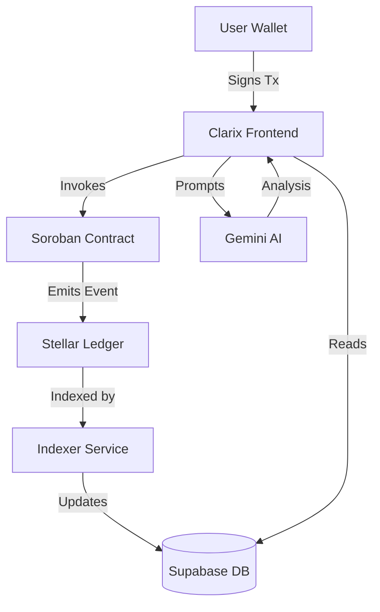

# Clarix System Architecture

Clarix is a hybrid decentralized application (dApp) that combines the speed of traditional web services with the trust and transparency of the Stellar blockchain.

## Component Overview

### 1. Frontend (React + Vite)
- **Framework**: React 18 with TypeScript.
- **Styling**: TailwindCSS for a modern, responsive fintech UI.
- **State Management**: React Context (Auth) and Hooks (Local state).
- **Wallet Integration**: Stellar Wallets Kit (Freighter, WalletConnect).

### 2. Blockchain Layer (Stellar + Soroban)
- **Network**: Stellar Testnet.
- **Smart Contracts**: 
  - `ClarixRegistry`: Stores fraud reports as immutable records.
  - `ClarixRewards`: Issues CLRX tokens to reporters.
- **SDK**: `@stellar/stellar-sdk` for transaction building and Soroban RPC interaction.
- **Advanced Features**: Fee Bump (Sponsorship) for gasless transaction submission.

### 3. Data & AI Layer
- **Database**: Supabase (PostgreSQL) for high-performance indexing of user profiles, watchlists, and metadata.
- **AI Engine**: Google Gemini Pro API for detailed wallet risk assessments and radar chart generation.
- **Real-time Monitoring**: Custom indexing service that syncs Soroban events to the local database.

## Data Flow

## Security Model
- **Gasless Flow**: Clarix Treasury sponsors network fees for critical operations (Fraud Reporting).
- **Immutable Proof**: Every security alert is backed by an on-chain transaction hash.
- **Access Control**: Supabase RLS ensures users can only modify their own metadata.
